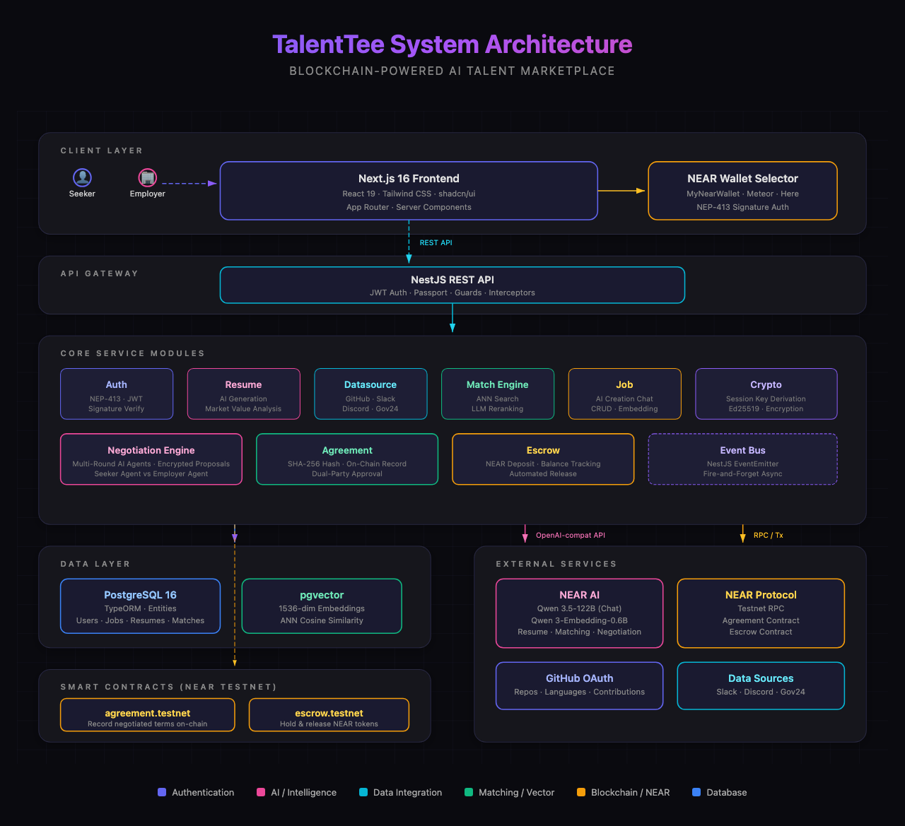

# TalentTee

**AI-powered recruitment negotiation platform built on NEAR Protocol.**

TalentTee connects job seekers and employers through intelligent AI matching, then deploys autonomous AI agents to negotiate salary, benefits, and contract terms on behalf of both parties. All negotiations are end-to-end encrypted and payments are handled transparently through blockchain escrow.

## Key Features

### AI-Powered Matching
- **ANN + Reranking**: Uses pgvector cosine similarity (Top-20) followed by AI-based reranking (Top-5) to find optimal seeker-job matches
- **Embedding Generation**: NEAR AI Cloud (Qwen3-Embedding-0.6B) generates vector embeddings for resumes and job descriptions
- **Auto-Triggered**: Matching runs automatically when a resume is completed, a job is published, or on a 6-hour cron schedule

### Autonomous AI Negotiation
- **Dual AI Agents**: Separate employer and seeker AI agents (Qwen3.5-122B via NEAR AI Cloud) negotiate in a round-robin loop
- **Structured Proposals**: Each round produces salary, benefits, remote policy, and signing bonus proposals with reasoning
- **Human Intervention**: Either party can inject real-time direction to their agent mid-negotiation
- **State Machine**: `INITIATED` → `EMPLOYER_OFFER` ↔ `SEEKER_COUNTER` ↔ `EMPLOYER_COUNTER` → `AGREED` / `FAILED`

### End-to-End Encryption
- **ECDH Key Exchange**: Ed25519 → X25519 conversion + HKDF-SHA256 derives a shared session key per negotiation
- **XChaCha20-Poly1305**: All negotiation rounds are encrypted at rest; only the involved parties can decrypt
- **Client-Side Decryption**: Seekers can decrypt in-browser using their NEAR wallet keypair

### Blockchain Escrow (NEAR Protocol)
- **Automated Payments**: Profile view fee (0.1 NEAR) is auto-charged when negotiation begins
- **Revenue Split**: 80% to job seeker, 20% to platform — enforced on-chain
- **Agent Authorization**: Employers grant a FunctionCall Access Key so the server can pay on their behalf
- **Transparent History**: All payments recorded on-chain with paginated access history

### GitHub Data Integration
- **OAuth Connection**: Seekers connect their GitHub account via OAuth
- **AI Resume Generation**: Analyzes repositories, contributions, and tech stack to auto-generate a structured resume
- **Market Value Analysis**: AI estimates market value based on skills and experience

## Architecture

<p align="center">
  
</p>

> Open [`docs/architecture-diagram.en.html`](docs/architecture-diagram.en.html) in a browser for the interactive version.

## Tech Stack

| Layer | Technology |
|-------|-----------|
| Frontend | Next.js 16.2.3 (Turbopack), React 19, Tailwind CSS v4 |
| Backend | NestJS 11, TypeORM, PostgreSQL 16 + pgvector |
| Blockchain | NEAR Protocol (Testnet), Rust smart contract (near-sdk) |
| AI | NEAR AI Cloud API — Qwen3.5-122B (chat), Qwen3-Embedding-0.6B (vectors) |
| Encryption | @noble/curves (ECDH), @noble/hashes (HKDF-SHA256), @noble/ciphers (XChaCha20-Poly1305) |
| Auth | NEAR Wallet NEP-413 signature + JWT |
| Realtime | Server-Sent Events (SSE) |
| Testing | Vitest + @testing-library/react (Frontend), Jest (Backend) |

## Project Structure

```
talent-tee/
├── frontend/                   # Next.js frontend
│   └── src/
│       ├── app/                # Pages
│       │   ├── login/          #   NEAR wallet login
│       │   ├── signup/         #   Role selection (seeker/employer)
│       │   ├── dashboard/      #   Seeker & employer dashboards
│       │   ├── matching/       #   AI match results
│       │   ├── jobs/           #   Job listings & AI-assisted creation
│       │   ├── negotiation/    #   Real-time negotiation monitor
│       │   ├── negotiations/   #   All negotiation sessions
│       │   ├── escrow/         #   NEAR deposit & payment history
│       │   ├── datasource/     #   GitHub/data source connections
│       │   └── analysis/       #   Market analysis
│       ├── components/         # Reusable UI components
│       └── lib/                # API client, crypto, NEAR wallet utils
├── backend/                    # NestJS backend
│   └── src/
│       ├── auth/               #   NEP-413 challenge-response + JWT
│       ├── match/              #   ANN + rerank matching engine
│       ├── negotiation/        #   AI negotiation session manager
│       ├── agent/              #   NEAR AI Cloud client
│       ├── escrow/             #   NEAR escrow RPC integration
│       ├── profile/            #   Profile access & AI report
│       ├── resume/             #   AI resume generation
│       ├── job/                #   Job CRUD + AI boundary chat
│       ├── datasource/         #   GitHub OAuth + data sync
│       ├── agreement/          #   Post-negotiation agreement
│       ├── crypto/             #   ECDH + XChaCha20 encryption
│       ├── sse/                #   Server-Sent Events
│       └── seed.ts             #   Demo data seeder
├── contract/                   # NEAR smart contracts
│   └── escrow/                 #   Escrow contract (Rust)
│       └── src/lib.rs          #   Deposit, pay, withdraw, agent auth
├── docs/                       # Pitch decks & documentation
└── docker-compose.yml          # PostgreSQL + pgvector
```

## User Flows

### Job Seeker
1. **Sign up** with NEAR wallet (role: Seeker)
2. **Connect data sources** — GitHub OAuth, etc.
3. **AI generates resume** — analyzes repos, contributions, tech stack → structured resume + market value estimate
4. **Auto-matching** — AI finds Top-5 job matches from all active postings
5. **AI negotiates** — autonomous agent handles salary, benefits, remote policy on your behalf
6. **Review & accept** — decrypt negotiation results, approve or reject final terms
7. **Earn rewards** — receive 80% of profile view fees (0.08 NEAR per view)

### Employer
1. **Sign up** with NEAR wallet (role: Employer)
2. **Deposit NEAR** to escrow account
3. **Create job posting** — AI-assisted job description + negotiation boundary (salary range, non-negotiables, flex items)
4. **Publish job** → AI auto-matches Top-5 candidates
5. **Auto-payment** — 0.1 NEAR per candidate charged from escrow for resume access
6. **AI negotiates** — autonomous agent negotiates within your defined boundaries
7. **Review & hire** — view AI-generated candidate reports, approve final terms

## Getting Started

### Prerequisites

- Node.js 20+
- Docker Desktop (for PostgreSQL)
- Rust + cargo-near (only for smart contract builds)

### 1. Clone the Repository

```bash
git clone https://github.com/your-org/talent-tee.git
cd talent-tee
```

### 2. Start the Database

```bash
docker compose up -d
```

This starts PostgreSQL with pgvector on `localhost:5434`.

### 3. Start the Backend

```bash
cd backend
npm install
cp .env.example .env   # Configure environment variables
npm run start:dev
```

The API server runs at `http://localhost:4000`.

<details>
<summary>Backend Environment Variables (.env)</summary>

```env
PORT=4000

# Database
DATABASE_HOST=localhost
DATABASE_PORT=5434
DATABASE_NAME=near_agent
DATABASE_USER=near_agent
DATABASE_PASSWORD=near_agent_dev

# Auth
JWT_SECRET=your-jwt-secret
JWT_EXPIRES_IN=24h

# NEAR Protocol
NEAR_NETWORK_ID=testnet
NEAR_NODE_URL=https://rpc.testnet.near.org
ESCROW_CONTRACT_ID=escrow.sooondae17.testnet
SERVER_KEYPAIR_SEED=talent-tee-dev-seed-2026

# NEAR AI
NEAR_AI_API_KEY=your-near-ai-api-key
NEAR_AI_BASE_URL=https://cloud-api.near.ai/v1
NEAR_AI_CHAT_MODEL=Qwen/Qwen3.5-122B-A10B
NEAR_AI_EMBED_MODEL=Qwen/Qwen3-Embedding-0.6B

# GitHub OAuth
GITHUB_CLIENT_ID=your-github-client-id
GITHUB_CLIENT_SECRET=your-github-client-secret
GITHUB_CALLBACK_URL=http://localhost:4000/datasource/callback/github
FRONTEND_URL=http://localhost:3000
```
</details>

### 4. Start the Frontend

```bash
cd frontend
npm install
npm run dev
```

Open `http://localhost:3000` in your browser.

### 5. Seed Demo Data (Optional)

```bash
cd backend
npm run seed          # Full seed with real AI negotiation
npm run seed:demo     # Demo data only (no AI calls, fast)
```

Creates 20 seekers, 4 employers, 12 jobs, and triggers AI matching + negotiation.

## Smart Contract

The escrow contract is deployed on NEAR Testnet at `escrow.sooondae17.testnet`.

### Methods

| Method | Access | Description |
|--------|--------|-------------|
| `deposit()` | Employer | Deposit NEAR to escrow (payable) |
| `pay_for_profile(employer_id, seeker_id)` | Employer or Agent | Pay 0.1 NEAR for resume access (80/20 split) |
| `withdraw(amount)` | Employer | Withdraw NEAR from escrow |
| `get_balance(employer_id)` | Public | Query escrow balance |
| `get_access_history(employer_id)` | Public | View payment records (max 1000, FIFO) |
| `get_seeker_earnings(seeker_id)` | Public | View seeker's total earnings & view count |
| `authorize_agent(agent_id)` | Employer | Grant agent permission to pay on behalf |
| `revoke_agent(agent_id)` | Employer | Revoke agent permission |
| `set_profile_view_cost(cost)` | Owner only | Update profile view fee |

### Build the Contract

```bash
cd contract/escrow
cargo-near near build non-reproducible-wasm
```

> Requires Rust 1.86.0 or lower (1.87+ is incompatible with NEAR VM)

## API Endpoints

### Authentication
| Method | Endpoint | Description |
|--------|----------|-------------|
| POST | `/auth/near/challenge` | Generate NEAR wallet signature challenge |
| POST | `/auth/near/verify` | Verify signature & issue JWT |

### Jobs
| Method | Endpoint | Description |
|--------|----------|-------------|
| GET | `/jobs` | List jobs |
| POST | `/jobs` | Create job (employer) |
| POST | `/jobs/:id/publish` | Publish & trigger matching |
| POST | `/jobs/chat` | AI-assisted job creation |
| POST | `/jobs/:id/boundary/chat` | AI-assisted negotiation boundary |
| POST | `/jobs/salary-recommend` | AI salary recommendation |

### Matching
| Method | Endpoint | Description |
|--------|----------|-------------|
| GET | `/match/me` | Get seeker's matches |
| POST | `/match/me/refresh` | Re-run matching |
| GET | `/match/job/:jobId` | Get job's matches |

### Negotiation
| Method | Endpoint | Description |
|--------|----------|-------------|
| GET | `/negotiation/sessions` | List sessions |
| POST | `/negotiation/sessions` | Create session |
| POST | `/negotiation/sessions/:id/start` | Start AI negotiation |
| GET | `/negotiation/sessions/:id/rounds/decrypted` | Get decrypted rounds |
| POST | `/negotiation/sessions/:id/intervene` | Human intervention |

### Escrow
| Method | Endpoint | Description |
|--------|----------|-------------|
| GET | `/escrow/balance` | Query escrow balance |
| POST | `/escrow/deposit` | Get deposit transaction params |
| GET | `/escrow/payments` | Payment history |

### Profile & Resume
| Method | Endpoint | Description |
|--------|----------|-------------|
| POST | `/profile/:seekerId/access` | Request access (auto-pays escrow) |
| GET | `/profile/:seekerId/report` | AI-generated candidate report |
| POST | `/resume/generate` | Generate AI resume from datasources |
| GET | `/resume/me/market-value` | Market value analysis |

## Deployment

| Service | Platform | URL |
|---------|----------|-----|
| Frontend | Vercel | https://talenttee-sepia.vercel.app |
| Backend | Railway | https://talenttee-api-production.up.railway.app |
| Database | Railway PostgreSQL | Internal connection |
| Contract | NEAR Testnet | `escrow.sooondae17.testnet` |

## Testing

```bash
# Frontend (Vitest)
cd frontend && npm test

# Backend (Jest)
cd backend && npm test
```

## License

UNLICENSED
