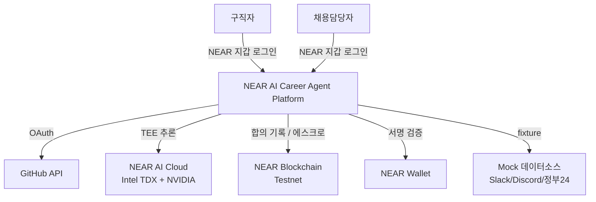
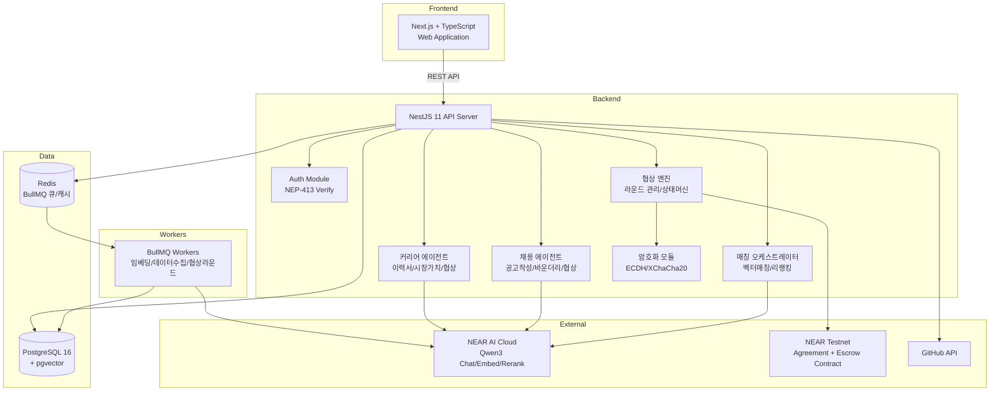
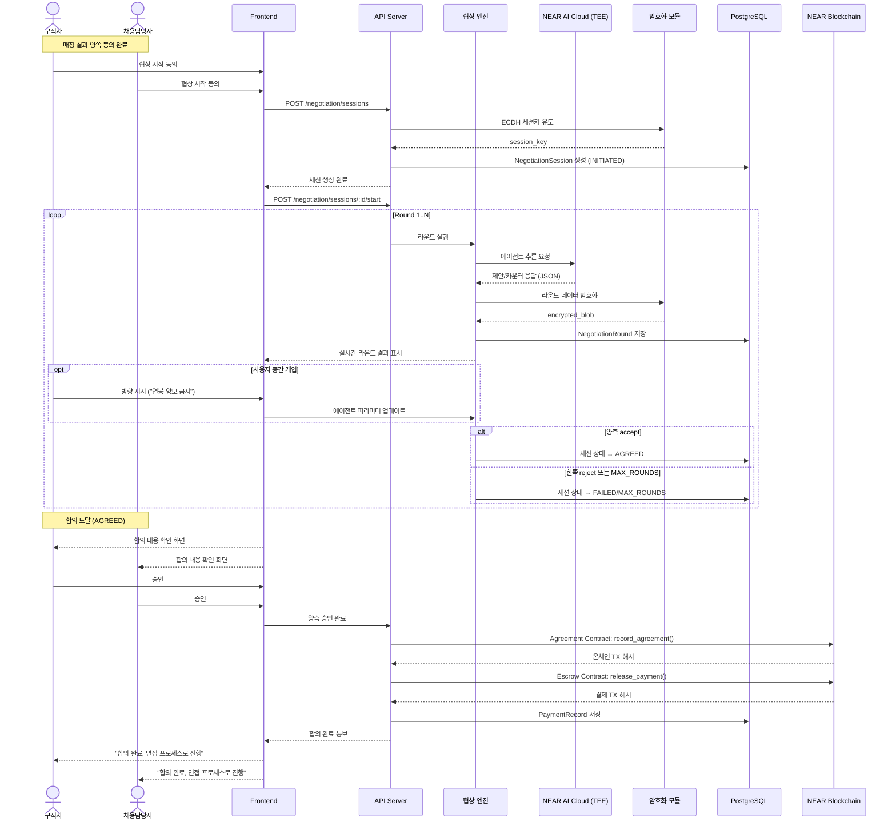
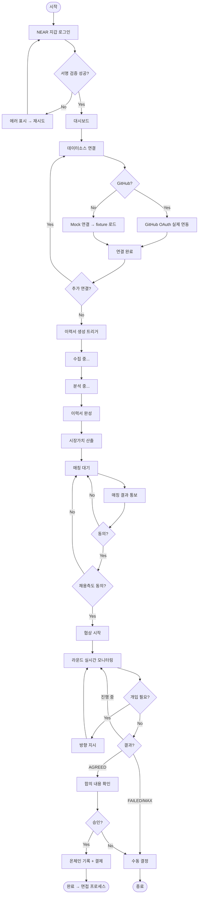
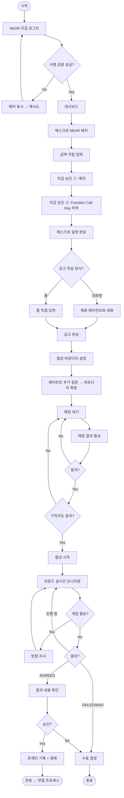
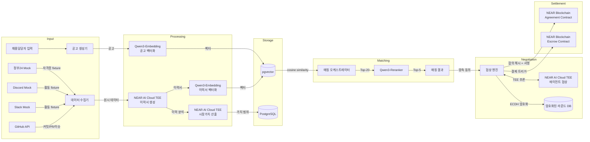
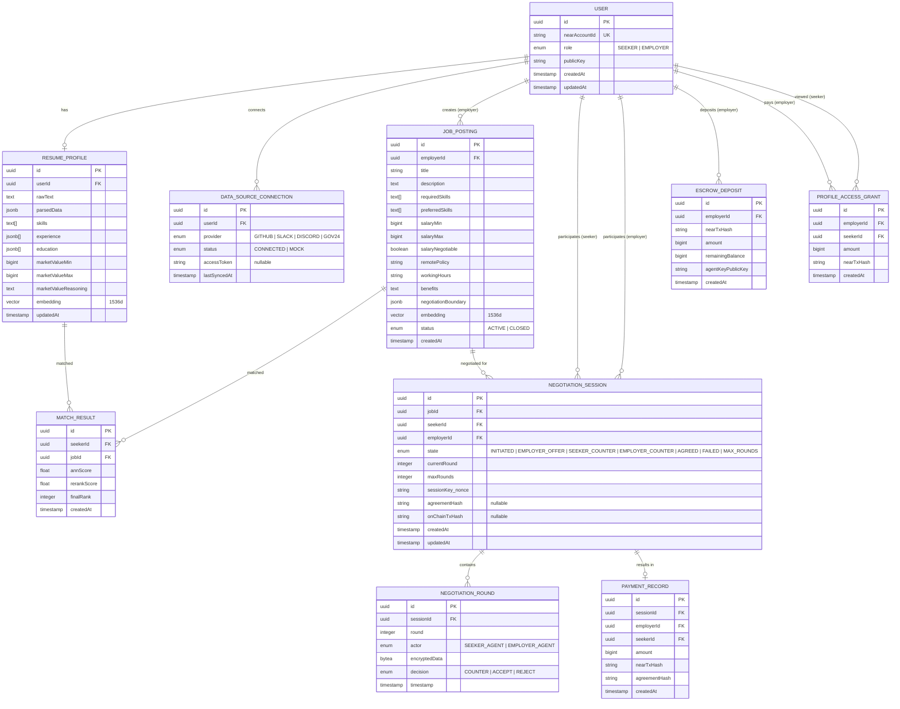
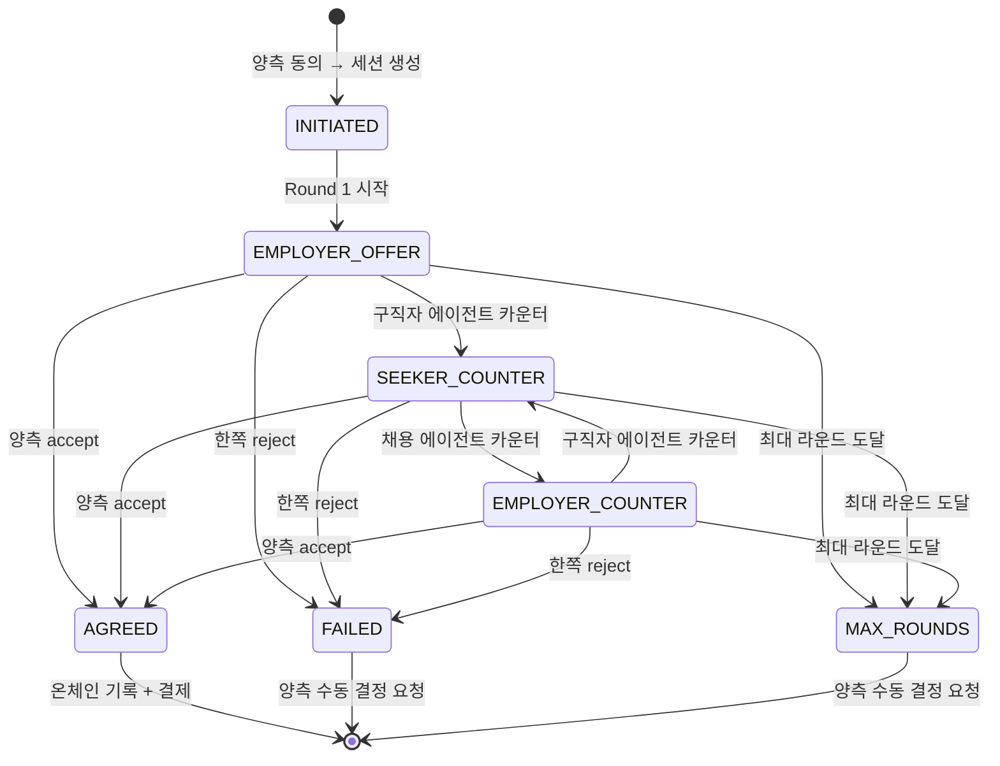

# NEAR AI Career Agent Platform — PRD (Product Requirements Document)

> Author: Claude (PRD Interview Skill)
> Requester: javis.hwang
> Date: 2026-04-11
> Status: DRAFT — 요청자 합의 대기

---

## 1. 개요 (Overview)

### 1.1 한 줄 요약

> NEAR 지갑으로 로그인한 구직자와 채용담당자가 각각 AI 에이전트를 보유하고, 에이전트끼리 TEE 환경에서 자율적으로 채용 조건을 협상하며, 합의 시 NEAR 블록체인에 기록하고 에스크로 결제까지 자동으로 실행하는 플랫폼.

### 1.2 배경 및 동기

현재 채용 시장에서 구직자는 직접 이력서를 관리하고, 채용담당자와 수동으로 조건을 주고받으며 협상한다. 이 과정은 느리고, 정보 비대칭이 크며, 특히 인사팀이 없는 작은 회사는 공고 작성조차 어렵다.

이 프로젝트의 핵심 동기는 세 가지다:

| #   | 동기                                | 설명                                                                                           |
| --- | ----------------------------------- | ---------------------------------------------------------------------------------------------- |
| 1   | **NEAR 기술 활용 시연**             | NEAR AI Cloud TEE, 스마트컨트랙트, 에스크로, Meta Transaction 등을 실제 서비스에 적용하는 데모 |
| 2   | **채용 시장 비효율 해결**           | 구직자-채용자 간 조건 협상의 비효율과 정보 비대칭을 AI 에이전트로 해소                         |
| 3   | **AI 에이전트 자율 협상 컨셉 검증** | AI 에이전트끼리 자율적으로 협상하는 컨셉의 기술적 가능성 시연                                  |

### 1.3 대상 사용자

| 사용자 유형    | 설명                                                       | 주요 행동                                                                                       |
| -------------- | ---------------------------------------------------------- | ----------------------------------------------------------------------------------------------- |
| **구직자**     | 개발자, 자신의 커리어 관리를 에이전트에 위임하고 싶은 사람 | NEAR 로그인 → 데이터소스 연결 → 이력서 생성 → 매칭 확인 → 협상 모니터링 → 결과 확인             |
| **채용담당자** | 인사팀이 없는 작은 회사, 공고 작성이 어려운 담당자         | NEAR 로그인 → 에스크로 예치 → 대화형 공고 작성 → 협상 바운더리 설정 → 협상 모니터링 → 결과 확인 |

---

## 2. 범위 (Scope)

### 2.1 In Scope

| #   | 기능                                     | 우선순위 | 설명                                                                                       |
| --- | ---------------------------------------- | -------- | ------------------------------------------------------------------------------------------ |
| 1   | NEAR 지갑 로그인                         | MUST     | NEP-413 서명 검증으로 로그인, 서버에서 Ed25519 검증 후 JWT 발급                            |
| 2   | 데이터소스 연결                          | MUST     | GitHub OAuth 실제 연동 + Slack/Discord/정부24 mock 연결 UI                                 |
| 3   | 이력서 생성/최신화                       | MUST     | 수동 트리거 → 에이전트가 분석 중 상태 표시 → 완성된 이력서 표시                            |
| 4   | 시장가치 산출                            | MUST     | 유사 공고 비교 기반 적정 연봉 범위 + 협상 포인트 도출                                      |
| 5   | 대화형 + 폼 공고 작성                    | MUST     | 채용 에이전트가 질문으로 공고 채워나가기 + 폼 직접 입력 지원                               |
| 6   | 협상 바운더리 설정                       | MUST     | 채용 에이전트가 추가 질문으로 연봉 상한, 양보 가능 조건 등 설정                            |
| 7   | 2단계 시맨틱 매칭                        | MUST     | Qwen3-Embedding 벡터 유사도 Top-20 → Qwen3-Reranker 정밀 리랭킹 Top-5                      |
| 8   | 매칭 결과 + 상세 프로필 열람 (토큰 결제) | MUST     | 매칭 Top-5는 기본 정보만 무료 표시, 에이전트 분석 리포트 열람은 에스크로 결제 필요         |
| 9   | 매칭 동의 → 협상 세션 생성               | MUST     | 상세 프로필 확인 후 양쪽 동의 시 협상 세션 생성                                            |
| 10  | TEE 자율 협상                            | MUST     | NEAR AI Cloud TEE에서 에이전트 간 N라운드 협상, 실시간 라운드 표시 + 사용자 중간 개입 가능 |
| 11  | 합의 → 온체인 기록                       | MUST     | 사용자 확인 후 합의 해시 + 조건 요약 + 양측 서명을 NEAR 블록체인에 기록                    |
| 12  | 에스크로 예치 + 프로필 열람 결제         | MUST     | 채용담당자가 NEAR 예치, 상세 프로필 열람 시 Function Call Key로 자동 결제                  |
| 13  | 협상 히스토리 열람                       | MUST     | ECDH 복호화(지갑 자동 처리)로 양측 협상 라운드 전체 열람                                   |
| 14  | E2E 암호화                               | MUST     | Ed25519→Curve25519 변환, X25519 ECDH 공유키, XChaCha20-Poly1305 대칭 암호화                |

### 2.2 Out of Scope

| #   | 제외 항목                  | 이유                          |
| --- | -------------------------- | ----------------------------- |
| 1   | 모바일 앱                  | 해커톤 범위 초과, 웹 우선     |
| 2   | 실시간 채팅                | 협상은 비동기 라운드 방식     |
| 3   | 실제 면접 프로세스 관리    | 합의 후 면접은 서비스 범위 밖 |
| 4   | 법적 구속력 있는 계약 체결 | 법률 영역, 데모 범위 초과     |
| 5   | 정부24 실제 API 연동       | mock으로 대체                 |

### 2.3 성공 기준

| #   | 기준                      | 측정 방법                                                         |
| --- | ------------------------- | ----------------------------------------------------------------- |
| 1   | End-to-End 데모 완주      | 로그인→이력서→공고→매칭→협상→결제 전체 라이브 시연 성공 여부      |
| 2   | NEAR 기술 활용도          | AI Cloud TEE, 스마트컨트랙트, 에스크로, NEP-413이 의미있게 사용됨 |
| 3   | 에이전트 협상 과정 가시화 | 라운드별 협상 진행이 화면에서 실시간으로 확인 가능                |

---

## 3. 기능 요구사항 (Functional Requirements)

### 3.1 사용자 여정 (User Journey)

**구직자 여정:**

```
NEAR 지갑 로그인 → 대시보드 → 데이터소스 연결(GitHub OAuth + mock)
→ '이력서 생성' 트리거 → 에이전트 분석 중 → 이력서 완성 + 시장가치 표시
→ 매칭 결과 확인 → 동의 → 협상 실시간 모니터링(중간 개입 가능)
→ 합의 확인 → 승인 → 온체인 기록 + 결제 → 결과 통보
```

**채용담당자 여정:**

```
NEAR 지갑 로그인 → 대시보드 → 에스크로에 NEAR 예치(직접 금액 입력)
→ 에이전트에 Function Call Key 부여
→ 채용 에이전트와 대화형 공고 작성(또는 폼 입력)
→ 협상 바운더리 설정 → 매칭 결과 확인 → 동의
→ 협상 실시간 모니터링(중간 개입 가능)
→ 합의 확인 → 승인 → 온체인 기록 + 결제 → 결과 통보
```

### 3.2 기능 명세

#### FR-001: NEAR 지갑 로그인

- **설명**: NEAR 지갑(near-connect)으로 로그인하고, 서버에서 Ed25519 서명을 검증하여 JWT를 발급한다
- **사용자**: 구직자, 채용담당자
- **트리거**: 로그인 버튼 클릭
- **입력**: NEAR 지갑 서명 (NEP-413)
- **동작**:
    1. 서버가 challenge nonce 발급 (`POST /auth/near/challenge`)
    2. 프론트엔드가 지갑에 서명 요청
    3. 서명을 서버에 전송 (`POST /auth/near/verify`)
    4. 서버가 Ed25519 서명 검증 (near-sign-verify)
    5. 검증 성공 시 JWT + User 정보 반환
    6. 첫 로그인이면 User 레코드 생성 (nearAccountId, role, publicKey)
- **출력/결과**: JWT 토큰, 대시보드로 이동
- **예외 처리**: 서명 검증 실패 시 "서명 검증에 실패했습니다. 다시 시도해주세요." 에러 표시
- **수락 기준(AC)**:
    - Given 사용자가 NEAR 지갑을 보유하고 있을 때
    - When 로그인 버튼을 클릭하고 지갑에서 서명을 승인하면
    - Then JWT가 발급되고 대시보드로 이동한다

#### FR-002: 데이터소스 연결

- **설명**: GitHub는 실제 OAuth로 연결하고, Slack/Discord/정부24는 mock fixture로 "연결됨" 상태를 시뮬레이션한다
- **사용자**: 구직자
- **트리거**: 대시보드에서 데이터소스 연결 버튼 클릭
- **입력**: GitHub OAuth 인증 코드 (GitHub만) / provider 이름 (mock)
- **동작**:
    - GitHub: `GET /datasource/connect/github` → OAuth redirect → callback → 액세스 토큰 저장
    - Mock: `POST /datasource/connect/mock` → provider별 fixture 데이터 로드 → "CONNECTED" 상태
- **출력/결과**: DataSourceConnection 레코드 생성 (status: CONNECTED 또는 MOCK)
- **예외 처리**: GitHub OAuth 실패 시 재시도 안내
- **수락 기준(AC)**:
    - Given 구직자가 로그인된 상태일 때
    - When GitHub 연결 버튼을 클릭하고 OAuth를 승인하면
    - Then DataSourceConnection이 CONNECTED 상태로 생성되고 연결 상태 목록에 표시된다
    - Given 구직자가 Slack 연결 버튼을 클릭하면
    - When mock 연결이 실행되면
    - Then DataSourceConnection이 MOCK 상태로 생성되고 fixture 데이터가 로드된다

#### FR-003: 이력서 생성/최신화

- **설명**: 사용자가 수동으로 이력서 생성을 트리거하면, 커리어 에이전트가 연결된 데이터소스에서 데이터를 수집하고, NEAR AI Cloud TEE에서 LLM이 이력서를 생성/분석한다. 단계별 상태(수집 중 → 분석 중 → 완성)를 UI에 표시한다.
- **사용자**: 구직자
- **트리거**: 대시보드에서 '이력서 생성' 버튼 클릭
- **입력**: 연결된 데이터소스의 원시 데이터
- **동작**:
    1. 사용자가 '이력서 생성' 버튼 클릭 → `POST /resume/upload` (202 Accepted)
    2. BullMQ 작업 생성 → 상태: "수집 중"
    3. 각 데이터소스에서 데이터 수집 (GitHub: 실제 API / 나머지: fixture)
    4. Slack/Discord 데이터 분류 (작업/논의/피드백 — LLM 프롬프트 기반)
    5. 수집 완료 → 상태: "분석 중"
    6. NEAR AI Cloud TEE로 데이터 전송 → Qwen3 Chat 모델이 이력서 생성
    7. skills[], experience[], education[] 파싱 → 상태: "완성"
    8. Qwen3-Embedding으로 이력서 벡터 임베딩 생성 → pgvector 저장
- **출력/결과**: ResumeProfile 레코드 (parsedData, skills, experience, education, embedding)
- **예외 처리**: 데이터소스 연결 없이 트리거 시 "먼저 데이터소스를 연결해주세요" 안내
- **수락 기준(AC)**:
    - Given 구직자가 최소 1개 데이터소스를 연결한 상태일 때
    - When '이력서 생성' 버튼을 클릭하면
    - Then 상태가 "수집 중" → "분석 중" → "완성"으로 순차 표시되고, 완성된 이력서가 화면에 나타난다

#### FR-004: 시장가치 산출

- **설명**: 이력서 분석 결과와 DB 내 유사 공고 데이터를 기반으로, NEAR AI Cloud TEE에서 적정 연봉 범위와 협상 포인트를 산출한다
- **사용자**: 구직자
- **트리거**: 이력서 생성 완료 후 자동 실행
- **입력**: 이력 분석 결과 (경력년수, 스킬셋, 희소성, 활동량) + DB 내 유사 공고 연봉/조건 데이터
- **동작**:
    1. 이력서 완성 시 자동으로 시장가치 산출 작업 트리거
    2. NEAR AI Cloud TEE에서 Qwen3가 유사 포지션 연봉 범위 분석
    3. 내 이력 대비 시장 포지셔닝
    4. 강점/약점 대비 협상 포인트 도출
- **출력/결과**: marketValueMin, marketValueMax, marketValueReasoning → ResumeProfile 업데이트
- **예외 처리**: 유사 공고 데이터 부족 시 "데이터가 충분하지 않아 추정치입니다" 표시
- **수락 기준(AC)**:
    - Given 이력서가 완성된 상태일 때
    - When 시장가치 산출이 자동 실행되면
    - Then "적정 연봉 범위: X~Y만원" + 근거 요약이 표시된다

#### FR-005: 대화형 + 폼 공고 작성

- **설명**: 채용 에이전트가 챗봇 형태로 질문하며 공고를 채워나가거나, 채용담당자가 폼에 직접 입력하여 공고를 작성한다
- **사용자**: 채용담당자
- **트리거**: 대시보드에서 '공고 작성' 클릭
- **입력**: 대화 메시지 또는 폼 입력 (포지션, 기술스택, 경력, 연봉, 근무조건 등)
- **동작**:
    - 대화형: `POST /jobs/chat` → 채용 에이전트가 질문 → 답변 기반으로 공고 구조화
    - 폼: 직접 필드 입력 → 공고 생성
    - 공고 완성 시 Qwen3-Embedding으로 공고 벡터 임베딩 생성
- **출력/결과**: JobPosting 레코드 (title, description, requiredSkills, salaryMin/Max, embedding 등)
- **예외 처리**: 필수 항목 미입력 시 에이전트가 해당 항목 재질문
- **수락 기준(AC)**:
    - Given 채용담당자가 로그인된 상태일 때
    - When 채용 에이전트와 대화하여 모든 필수 항목을 답변하면
    - Then 구조화된 채용공고가 생성되고 ACTIVE 상태로 저장된다

#### FR-006: 협상 바운더리 설정

- **설명**: 공고 작성 후 채용 에이전트가 추가 질문으로 협상 파라미터(연봉 상한, 양보 가능 조건, 양보 불가 조건)를 설정한다
- **사용자**: 채용담당자
- **트리거**: 공고 작성 완료 직후 자동 진행
- **입력**: 채용담당자의 대화 답변
- **동작**:
    1. 채용 에이전트가 "연봉 상한은 얼마까지?", "원격근무 양보 가능?" 등 질문
    2. 답변을 구조화: 각 항목별 제시 범위 / 상한 / 양보 가능 여부
    3. negotiationBoundary JSON으로 JobPosting에 저장
- **출력/결과**: JobPosting.negotiationBoundary 업데이트
- **예외 처리**: 바운더리 미설정 시 협상 불가 안내
- **수락 기준(AC)**:
    - Given 공고 작성이 완료된 상태일 때
    - When 채용 에이전트의 추가 질문에 답변하면
    - Then negotiationBoundary가 설정되고, 이후 협상 시 에이전트가 이 범위 내에서 협상한다

#### FR-007: 2단계 시맨틱 매칭

- **설명**: 이력서 임베딩과 공고 임베딩의 벡터 유사도로 1차 필터링(Top-20) 후, 리랭커로 정밀 평가하여 최종 Top-5를 도출한다
- **사용자**: 시스템 (매칭 오케스트레이터)
- **트리거**: 새 공고 등록 또는 새 이력서 완성 시 자동
- **입력**: 이력서 임베딩 벡터 + 공고 임베딩 벡터
- **동작**:
    1. Step 1: pgvector cosine similarity → Top-20 후보
    2. Step 2: Qwen3-Reranker로 이력서 텍스트 + 공고 텍스트 정밀 평가 → Top-5
    3. MatchResult 레코드 생성 (annScore, rerankScore, finalRank)
- **출력/결과**: 구직자별 Top-5 매칭 공고, 공고별 Top-5 매칭 후보자
- **예외 처리**: 매칭 후보 없을 시 "현재 조건에 맞는 매칭이 없습니다" 표시
- **수락 기준(AC)**:
    - Given 이력서와 공고가 각각 1개 이상 존재할 때
    - When 매칭이 실행되면
    - Then 유사도 기반 Top-5 결과가 생성되고 양측에 표시된다

#### FR-008: 상세 프로필 열람 (토큰 결제)

- **설명**: 매칭 결과에서 기본 정보(스킬 태그, 경력 구간, 매칭 점수)는 무료로 표시된다. 채용담당자가 특정 후보의 커리어 에이전트가 분석/정리한 상세 리포트를 열람하려면 에스크로에서 토큰을 결제해야 한다. 구직자의 원천 데이터소스(GitHub 커밋, Slack 메시지 등)에는 직접 접근할 수 없고, 에이전트가 가공한 분석 결과만 열람 가능하다.
- **사용자**: 채용담당자
- **트리거**: 매칭 결과에서 '상세 프로필 보기' 클릭
- **입력**: 열람 대상 구직자 ID
- **동작**:
    1. 에스크로 잔액 확인
    2. 잔액 충분 → Escrow Contract `pay_for_profile()` 호출 (Function Call Key, 지갑 팝업 없음)
    3. ProfileAccessGrant 레코드 생성 (employerId, seekerId, amount, txHash)
    4. 커리어 에이전트가 정리한 상세 프로필 반환
- **상세 프로필 포함 내용**:

| 항목               | 설명                                     | 원천                        |
| ------------------ | ---------------------------------------- | --------------------------- |
| 기술 역량 상세     | 언어별 숙련도, 프레임워크 경험 깊이      | GitHub + 이력서 분석        |
| 프로젝트 경험      | 주요 기여 프로젝트, 역할, 임팩트 요약    | GitHub + Slack/Discord 분석 |
| 협업/리더십 시그널 | 코드 리뷰 빈도, 토론 참여도, 피드백 패턴 | Slack/Discord 분류 결과     |
| 성장 곡선          | 시간에 따른 기술 확장 추세               | GitHub 히스토리             |
| 자격/학력          | 자격증, 학위                             | 정부24 (mock)               |
| 시장가치 범위      | 적정 연봉 구간 (구직자 동의 시에만 표시) | 시장가치 산출 결과          |

- **출력/결과**: ProfileAccessGrant + 상세 프로필 데이터
- **예외 처리**: 에스크로 잔액 부족 시 "잔액이 부족합니다. 추가 예치해주세요" 안내
- **수락 기준(AC)**:
    - Given 매칭 결과에서 후보자가 표시된 상태일 때
    - When 채용담당자가 '상세 프로필 보기'를 클릭하면
    - Then 에스크로에서 열람 비용이 자동 차감되고 에이전트 분석 리포트가 표시된다
    - Given 에스크로 잔액이 부족할 때
    - When '상세 프로필 보기'를 클릭하면
    - Then 잔액 부족 안내와 함께 추가 예치 화면으로 이동한다

#### FR-009: 매칭 동의 → 협상 세션 생성

- **설명**: 채용담당자가 상세 프로필을 열람한 후, 양측이 동의하면 협상 세션을 생성한다
- **사용자**: 구직자, 채용담당자
- **트리거**: 매칭 결과에서 동의 버튼 클릭
- **입력**: 매칭 결과 + 양측 동의 여부
- **동작**:
    1. 매칭 결과를 양측 대시보드에 통보
    2. 채용담당자: 상세 프로필 열람 후 동의 (FR-008 결제 선행)
    3. 구직자: 공고 확인 후 동의
    4. 양쪽 동의 시 NegotiationSession 생성 (state: INITIATED)
    5. ECDH 세션키 유도 (Ed25519→Curve25519 변환, X25519 ECDH, HKDF-SHA256)
- **출력/결과**: NegotiationSession 레코드 (state: INITIATED, sessionKey_nonce)
- **예외 처리**: 한쪽이 거절하면 세션 미생성, 다음 매칭으로 진행
- **수락 기준(AC)**:
    - Given 채용담당자가 상세 프로필을 열람한 상태이고, 매칭 결과가 양측에 표시된 상태일 때
    - When 양쪽 모두 동의 버튼을 클릭하면
    - Then 협상 세션이 INITIATED 상태로 생성된다

#### FR-010: TEE 자율 협상 (실시간 + 사용자 개입)

- **설명**: NEAR AI Cloud TEE 환경에서 커리어 에이전트와 채용 에이전트가 N라운드 자율 협상을 수행한다. 각 라운드가 실시간으로 화면에 표시되며, 사용자가 중간에 방향을 수정할 수 있다.
- **사용자**: 구직자 (모니터링/개입), 채용담당자 (모니터링/개입)
- **트리거**: `POST /negotiation/sessions/:id/start`
- **입력**: 구직자 시장가치 + 선호 조건, 채용측 공고 + negotiationBoundary
- **동작**:
    1. Round 1: 채용 에이전트 → 초기 오퍼 (공고 기준)
    2. Round 2: 커리어 에이전트 → 카운터 (시장가치 + 구직자 선호)
    3. Round N: 반복 (양보/수정 제안)
    4. 매 라운드: 제안 내용을 ECDH 공유키로 암호화 → PostgreSQL 저장
    5. 매 라운드: 실시간으로 양측 화면에 라운드 결과 표시
    6. 사용자 개입: 사용자가 에이전트에게 방향 지시 가능 (예: "연봉은 양보하지 마")
    7. 각 라운드 출력: 구조화된 JSON (round, actor, proposal, reasoning, decision)
- **출력/결과**: NegotiationRound 레코드들 (encryptedData, decision)
- **예외 처리**: TEE 연결 실패 시 재시도, LLM 응답 타임아웃 시 해당 라운드 재실행
- **협상 항목**:

| 카테고리  | 항목                                             |
| --------- | ------------------------------------------------ |
| 연봉/보상 | 기본급, 성과 보너스, 스톡옵션/RSU, 사이닝 보너스 |
| 근무조건  | 원격/출근 비율, 근무시간, 연차/휴가, 장비 지원   |
| 포괄 조건 | 직급/타이틀, 소속 팀, 시작일, 수습기간           |

- **종료 조건**:

| 조건                      | 결과                                                      |
| ------------------------- | --------------------------------------------------------- |
| 양측 에이전트 모두 accept | AGREED → 합의 확인 단계                                   |
| 한쪽이 reject             | FAILED → 종료, 양측에 수동 결정 요청                      |
| currentRound >= maxRounds | MAX_ROUNDS → 종료, 마지막 제안 기준 양측에 수동 결정 요청 |

- **수락 기준(AC)**:
    - Given 협상 세션이 INITIATED 상태일 때
    - When 자동 협상이 시작되면
    - Then 각 라운드가 실시간으로 화면에 표시되고, 사용자가 에이전트에게 방향 지시를 보낼 수 있다
    - Given 양측 에이전트가 accept 결정을 내리면
    - When 합의에 도달하면
    - Then 세션 상태가 AGREED로 변경되고 양측에 합의 확인 화면이 표시된다

#### FR-011: 합의 확인 → 온체인 기록

- **설명**: 협상 합의 후, 양측 사용자가 합의 내용을 확인하고 승인하면, 합의 해시를 NEAR 블록체인에 기록한다. 결제는 이미 프로필 열람 시점(FR-008)에 완료되었으므로, 이 단계에서는 온체인 합의 기록만 수행한다.
- **사용자**: 구직자, 채용담당자
- **트리거**: 협상 AGREED 후 양측 승인 버튼 클릭
- **입력**: 합의 내용, 양측 서명
- **동작**:
    1. 양측에 합의 내용 확인 화면 표시
    2. 양측 모두 승인 → 합의 내용 SHA-256 해시 생성
    3. Agreement Contract: `record_agreement()` 호출 — 합의 해시 + 조건 요약 + 양측 서명
    4. NegotiationSession에 onChainTxHash 기록
    5. 양측에 "합의 완료, 면접 프로세스로 진행" 통보
- **출력/결과**: 온체인 AgreementRecord + 양측 통보
- **예외 처리**: 한쪽 미승인 시 대기
- **수락 기준(AC)**:
    - Given 협상이 AGREED 상태이고 양측이 합의 내용을 확인한 상태일 때
    - When 양측 모두 승인 버튼을 클릭하면
    - Then 합의 해시가 NEAR 블록체인에 기록된다

#### FR-012: 에스크로 예치

- **설명**: 채용담당자가 원하는 금액을 직접 입력하여 에스크로 컨트랙트에 NEAR를 예치하고, 에이전트에게 Function Call Access Key를 부여한다. 이 잔액은 상세 프로필 열람(FR-008) 시 자동 차감된다.
- **사용자**: 채용담당자
- **트리거**: 대시보드에서 '에스크로 예치' 클릭
- **입력**: 예치 금액 (NEAR)
- **동작**:
    1. 채용담당자가 금액 입력
    2. 지갑 승인 → Escrow Contract `deposit()` 호출 (1회 지갑 팝업)
    3. Function Call Access Key를 에이전트에 부여 (1회 지갑 팝업)
        - 키 제한: escrow_contract의 `pay_for_profile`만 호출 가능
    4. EscrowDeposit 레코드 생성
- **출력/결과**: 에스크로 잔액 반영, Function Call Key 설정 완료
- **예외 처리**: 잔액 부족 시 안내
- **수락 기준(AC)**:
    - Given 채용담당자가 NEAR를 보유하고 있을 때
    - When 금액을 입력하고 지갑에서 2번 승인하면 (예치 + 키 부여)
    - Then 에스크로 잔액이 반영되고, 에이전트가 pay_for_profile를 호출할 수 있게 된다

#### FR-013: 협상 히스토리 열람

- **설명**: 협상 완료 후 양측이 자신의 NEAR 지갑으로 ECDH 공유키를 복원하여 전체 라운드를 복호화하고 열람한다
- **사용자**: 구직자, 채용담당자
- **트리거**: 협상 세션 상세 페이지에서 '히스토리 보기' 클릭
- **입력**: 사용자의 NEAR 지갑 (자동 처리)
- **동작**:
    1. 지갑이 자동으로 개인키 접근 → ECDH 공유키 복원
    2. session_key 재생성 → 각 라운드 encryptedData 복호화
    3. 복호화된 라운드별 제안/응답 표시
- **출력/결과**: 전체 협상 라운드 히스토리 (복호화된 상태)
- **예외 처리**: 키 복원 실패 시 재시도 안내
- **수락 기준(AC)**:
    - Given 협상이 완료된 상태(AGREED/FAILED/MAX_ROUNDS)일 때
    - When 사용자가 '히스토리 보기'를 클릭하면
    - Then 지갑이 자동으로 복호화를 처리하고 전체 라운드 내역이 표시된다

---

## 4. 시스템 아키텍처 & 다이어그램 (Architecture & Diagrams)

### 4.1 시스템 컨텍스트 다이어그램 (System Context)



### 4.2 서비스 전체 구조 다이어그램 (Service Architecture)



### 4.3 시퀀스 다이어그램 — 협상 플로우 (핵심 MUST)



### 4.4 액티비티/플로우차트 (Activity Flow)

**구직자 여정 플로우차트:**



**채용담당자 여정 플로우차트:**



### 4.5 데이터 플로우 다이어그램 (Data Flow)



### 4.6 ERD (Entity Relationship Diagram)



### 4.7 데이터베이스 스키마 (Database Schema)

| 테이블명                   | 컬럼                   | 타입         | 제약조건                         | 설명                        |
| -------------------------- | ---------------------- | ------------ | -------------------------------- | --------------------------- |
| **user**                   | id                     | UUID         | PK, DEFAULT gen_random_uuid()    | 고유 식별자                 |
|                            | near_account_id        | VARCHAR(64)  | UNIQUE, NOT NULL                 | NEAR 계정 ID                |
|                            | role                   | VARCHAR(10)  | NOT NULL, CHECK(SEEKER/EMPLOYER) | 사용자 역할                 |
|                            | public_key             | VARCHAR(128) | NOT NULL                         | NEAR Ed25519 공개키         |
|                            | created_at             | TIMESTAMPTZ  | DEFAULT NOW()                    | 생성일시                    |
|                            | updated_at             | TIMESTAMPTZ  | DEFAULT NOW()                    | 수정일시                    |
| **resume_profile**         | id                     | UUID         | PK                               | 고유 식별자                 |
|                            | user_id                | UUID         | FK → user.id, UNIQUE             | 소유자                      |
|                            | raw_text               | TEXT         |                                  | 원본 이력서 텍스트          |
|                            | parsed_data            | JSONB        |                                  | 파싱된 구조화 데이터        |
|                            | skills                 | TEXT[]       |                                  | 기술 목록                   |
|                            | experience             | JSONB[]      |                                  | 경력 목록                   |
|                            | education              | JSONB[]      |                                  | 학력 목록                   |
|                            | market_value_min       | BIGINT       |                                  | 적정 연봉 하한              |
|                            | market_value_max       | BIGINT       |                                  | 적정 연봉 상한              |
|                            | market_value_reasoning | TEXT         |                                  | 산출 근거                   |
|                            | embedding              | VECTOR(1536) |                                  | 이력서 벡터 임베딩          |
|                            | updated_at             | TIMESTAMPTZ  | DEFAULT NOW()                    | 수정일시                    |
| **data_source_connection** | id                     | UUID         | PK                               | 고유 식별자                 |
|                            | user_id                | UUID         | FK → user.id                     | 소유자                      |
|                            | provider               | VARCHAR(20)  | NOT NULL                         | GITHUB/SLACK/DISCORD/GOV24  |
|                            | status                 | VARCHAR(10)  | NOT NULL                         | CONNECTED/MOCK              |
|                            | access_token           | VARCHAR(512) | NULLABLE                         | OAuth 토큰 (GitHub만)       |
|                            | last_synced_at         | TIMESTAMPTZ  |                                  | 마지막 동기화               |
| **job_posting**            | id                     | UUID         | PK                               | 고유 식별자                 |
|                            | employer_id            | UUID         | FK → user.id                     | 채용담당자                  |
|                            | title                  | VARCHAR(255) | NOT NULL                         | 포지션명                    |
|                            | description            | TEXT         | NOT NULL                         | 공고 상세                   |
|                            | required_skills        | TEXT[]       |                                  | 필수 기술                   |
|                            | preferred_skills       | TEXT[]       |                                  | 우대 기술                   |
|                            | salary_min             | BIGINT       |                                  | 연봉 하한                   |
|                            | salary_max             | BIGINT       |                                  | 연봉 상한                   |
|                            | salary_negotiable      | BOOLEAN      | DEFAULT TRUE                     | 연봉 협상 가능 여부         |
|                            | remote_policy          | VARCHAR(100) |                                  | 원격근무 정책               |
|                            | working_hours          | VARCHAR(100) |                                  | 근무시간                    |
|                            | benefits               | TEXT         |                                  | 복리후생                    |
|                            | negotiation_boundary   | JSONB        |                                  | 협상 바운더리               |
|                            | embedding              | VECTOR(1536) |                                  | 공고 벡터 임베딩            |
|                            | status                 | VARCHAR(10)  | DEFAULT 'ACTIVE'                 | ACTIVE/CLOSED               |
|                            | created_at             | TIMESTAMPTZ  | DEFAULT NOW()                    | 생성일시                    |
| **negotiation_session**    | id                     | UUID         | PK                               | 고유 식별자                 |
|                            | job_id                 | UUID         | FK → job_posting.id              | 대상 공고                   |
|                            | seeker_id              | UUID         | FK → user.id                     | 구직자                      |
|                            | employer_id            | UUID         | FK → user.id                     | 채용담당자                  |
|                            | state                  | VARCHAR(20)  | NOT NULL                         | 세션 상태                   |
|                            | current_round          | INTEGER      | DEFAULT 0                        | 현재 라운드                 |
|                            | max_rounds             | INTEGER      | NOT NULL                         | 최대 라운드                 |
|                            | session_key_nonce      | VARCHAR(64)  |                                  | ECDH 세션키 nonce           |
|                            | agreement_hash         | VARCHAR(64)  | NULLABLE                         | 합의 해시 (SHA-256)         |
|                            | on_chain_tx_hash       | VARCHAR(64)  | NULLABLE                         | 온체인 TX 해시              |
|                            | created_at             | TIMESTAMPTZ  | DEFAULT NOW()                    | 생성일시                    |
|                            | updated_at             | TIMESTAMPTZ  | DEFAULT NOW()                    | 수정일시                    |
| **negotiation_round**      | id                     | UUID         | PK                               | 고유 식별자                 |
|                            | session_id             | UUID         | FK → negotiation_session.id      | 소속 세션                   |
|                            | round                  | INTEGER      | NOT NULL                         | 라운드 번호                 |
|                            | actor                  | VARCHAR(20)  | NOT NULL                         | SEEKER_AGENT/EMPLOYER_AGENT |
|                            | encrypted_data         | BYTEA        | NOT NULL                         | ECDH 암호화된 제안 데이터   |
|                            | decision               | VARCHAR(10)  | NOT NULL                         | COUNTER/ACCEPT/REJECT       |
|                            | timestamp              | TIMESTAMPTZ  | DEFAULT NOW()                    | 기록 시각                   |
| **escrow_deposit**         | id                     | UUID         | PK                               | 고유 식별자                 |
|                            | employer_id            | UUID         | FK → user.id                     | 채용담당자                  |
|                            | near_tx_hash           | VARCHAR(64)  | NOT NULL                         | 예치 TX 해시                |
|                            | amount                 | BIGINT       | NOT NULL                         | 예치 금액 (yoctoNEAR)       |
|                            | remaining_balance      | BIGINT       | NOT NULL                         | 잔여 잔액                   |
|                            | agent_key_public_key   | VARCHAR(128) |                                  | Function Call Key           |
|                            | created_at             | TIMESTAMPTZ  | DEFAULT NOW()                    | 생성일시                    |
| **payment_record**         | id                     | UUID         | PK                               | 고유 식별자                 |
|                            | session_id             | UUID         | FK → negotiation_session.id      | 소속 세션                   |
|                            | employer_id            | UUID         | FK → user.id                     | 결제자                      |
|                            | seeker_id              | UUID         | FK → user.id                     | 수취자                      |
|                            | amount                 | BIGINT       | NOT NULL                         | 결제 금액                   |
|                            | near_tx_hash           | VARCHAR(64)  | NOT NULL                         | 결제 TX 해시                |
|                            | agreement_hash         | VARCHAR(64)  | NOT NULL                         | 합의 해시 (근거)            |
|                            | created_at             | TIMESTAMPTZ  | DEFAULT NOW()                    | 생성일시                    |
| **profile_access_grant**   | id                     | UUID         | PK                               | 고유 식별자                 |
|                            | employer_id            | UUID         | FK → user.id                     | 결제한 채용담당자           |
|                            | seeker_id              | UUID         | FK → user.id                     | 열람 대상 구직자            |
|                            | amount                 | BIGINT       | NOT NULL                         | 결제 금액 (yoctoNEAR)       |
|                            | near_tx_hash           | VARCHAR(64)  | NOT NULL                         | 결제 TX 해시                |
|                            | created_at             | TIMESTAMPTZ  | DEFAULT NOW()                    | 생성일시                    |
| **match_result**           | id                     | UUID         | PK                               | 고유 식별자                 |
|                            | seeker_id              | UUID         | FK → user.id                     | 구직자                      |
|                            | job_id                 | UUID         | FK → job_posting.id              | 공고                        |
|                            | ann_score              | FLOAT        |                                  | 벡터 유사도 점수            |
|                            | rerank_score           | FLOAT        |                                  | 리랭킹 점수                 |
|                            | final_rank             | INTEGER      |                                  | 최종 순위                   |
|                            | created_at             | TIMESTAMPTZ  | DEFAULT NOW()                    | 생성일시                    |

### 4.8 상태 다이어그램 — 협상 세션



---

## 5. 비기능 요구사항 (Non-Functional Requirements)

| #     | 카테고리    | 요구사항                                                                            | 기준/근거                                             |
| ----- | ----------- | ----------------------------------------------------------------------------------- | ----------------------------------------------------- |
| NFR-1 | 보안/암호화 | 협상 데이터는 ECDH 공유키로 E2E 암호화 (XChaCha20-Poly1305), 당사자만 복호화 가능   | 프라이버시 보호 — 플랫폼 운영자도 협상 내용 열람 불가 |
| NFR-2 | 보안/인증   | NEAR 지갑 NEP-413 서명 검증으로 인증, JWT 세션 관리                                 | 비밀번호 없는 Web3 인증                               |
| NFR-3 | 보안/결제   | Function Call Access Key는 escrow_contract의 release_payment만 호출 가능하도록 제한 | 에이전트 권한 최소화                                  |
| NFR-4 | 성능        | 벡터 매칭 (pgvector cosine similarity) 응답 1초 이내 (1만 건 기준)                  | 데모 시 원활한 UX                                     |
| NFR-5 | 성능        | 협상 라운드 1회 처리 시간 10초 이내 (NEAR AI Cloud TEE 추론 포함)                   | 실시간 표시 UX                                        |
| NFR-6 | 가용성      | PoC 데모 환경: 단일 서버, 동시 사용자 10명 이하                                     | 해커톤 데모 규모                                      |
| NFR-7 | 기술 제약   | NEAR Testnet 사용, Faucet으로 2 NEAR + 20 USDC 확보                                 | 테스트넷 환경                                         |
| NFR-8 | 기술 제약   | NEAR AI Cloud 모델: Qwen3 (Chat), Qwen3-Embedding, Qwen3-Reranker                   | NEAR AI Cloud 지원 모델                               |
| NFR-9 | 마감        | PoC 마감: 2026-04-17 (6일)                                                          | 해커톤 제출 기한                                      |

---

## 6. 미확인 사항 (Requester Unconfirmed)

| #   | 항목                                    | 요청자 답변    | AI 추정값                                                            | 개발자/팀 확인 필요           |
| --- | --------------------------------------- | -------------- | -------------------------------------------------------------------- | ----------------------------- |
| 1   | 협상 최대 라운드 수 (MAX_ROUNDS)        | "팀 논의 필요" | 5~7 라운드 (데모용으로 적당한 길이)                                  | 데모 시 적절한 라운드 수 결정 |
| 2   | Meta Transaction(NEP-366) 릴레이어 범위 | "팀 논의 필요" | PoC에서는 에스크로 TX만 적용, 나머지는 이후 확장                     | 6일 내 구현 가능 범위         |
| 3   | 에스크로 결제 금액 기준                 | 기존 PRD 미결  | 고정 금액(데모) 또는 합의 연봉의 N%                                  | 비즈니스 모델에 따라 결정     |
| 4   | 시장가치 산출 모델 세부 로직            | 기존 PRD 미결  | LLM 프롬프트 기반 (Qwen3에게 유사 공고 데이터 + 이력 분석 결과 전달) | 통계 모델 조합 여부           |
| 5   | 협상 에이전트 프롬프트 튜닝             | 기존 PRD 미결  | 중립적 스타일로 시작, 데모 후 조정                                   | 공격적/보수적 파라미터        |
| 6   | 주기적 데이터 동기화 (BullMQ 스케줄러)  | "팀 논의 필요" | PoC에서는 수동 트리거만, 주기적 동기화는 이후                        | 자동 동기화 주기/범위         |
| 7   | 전체 통계 대시보드                      | "팀 논의 필요" | PoC에서는 미구현, 이후 매칭 수/협상 성공률/에스크로 총액 표시        | 대시보드 항목/디자인          |
| 8   | 프론트엔드 UI 컴포넌트 라이브러리       | "팀 논의 필요" | shadcn/ui + Tailwind (빠른 프로토타이핑에 적합)                      | 팀 선호도 확인                |
| 9   | 프론트엔드 구현 범위                    | "팀 논의 필요" | 핵심 플로우 중심 (로그인→협상→결제 데모 플로우)                      | PoC 6일 내 구현 가능 범위     |
| 10  | Slack/Discord 실제 OAuth 연동           | 미확정         | PoC에서는 mock 유지, 이후 실제 연동                                  | 연동 우선순위                 |

---

## 7. 기술 스택 (Technology Stack)

### 프론트엔드

| 기술                 | 용도                       |
| -------------------- | -------------------------- |
| Next.js + TypeScript | 웹 애플리케이션 프레임워크 |
| UI 라이브러리        | 미확정 (팀 논의)           |
| near-connect         | NEAR 지갑 연결             |

### 백엔드

| 기술                     | 용도                                              |
| ------------------------ | ------------------------------------------------- |
| NestJS 11                | API 서버 프레임워크                               |
| TypeScript 5.7           | 타입 안전성                                       |
| PostgreSQL 16 + pgvector | 관계형 DB + 벡터 검색                             |
| TypeORM 0.3              | ORM (pgvector 커스텀 컬럼 지원)                   |
| BullMQ + Redis           | 비동기 작업 큐 (임베딩, 데이터 수집, 협상 라운드) |
| OpenAI SDK (v6+)         | NEAR AI Cloud 호출 (OpenAI 호환 API)              |

### NEAR / 블록체인

| 기술                     | 용도                              |
| ------------------------ | --------------------------------- |
| near-connect             | 지갑 연결 (프론트엔드)            |
| near-sign-verify         | NEP-413 서명 검증 (백엔드)        |
| near-api-js              | NEAR RPC 호출, 트랜잭션 검증      |
| near-sdk-rs + cargo-near | 스마트컨트랙트 개발/배포 (Rust)   |
| NEAR MCP Server          | 에이전트의 블록체인 상호작용 도구 |
| NEAR Testnet             | 개발/데모 환경                    |
| NEAR Faucet              | 테스트용 토큰 (2 NEAR + 20 USDC)  |

### AI / 모델

| 모델            | 용도                                                    |
| --------------- | ------------------------------------------------------- |
| Qwen3 (Chat)    | 이력서 분석, 시장가치 산출, 협상 추론, 공고 작성 가이드 |
| Qwen3-Embedding | 이력서/공고 벡터 임베딩                                 |
| Qwen3-Reranker  | 매칭 정밀 리랭킹                                        |

### 암호화

| 기술                  | 용도                                 |
| --------------------- | ------------------------------------ |
| libsodium (tweetnacl) | Ed25519→Curve25519 변환, X25519 ECDH |
| HKDF-SHA256           | 공유 비밀에서 세션키 유도            |
| XChaCha20-Poly1305    | 협상 데이터 대칭 암호화              |

---

## 8. 스마트컨트랙트

### 8.1 Agreement Contract (합의 기록)

```rust
pub struct AgreementRecord {
    pub session_id: String,
    pub agreement_hash: String,       // 합의 내용 전체의 SHA-256 해시
    pub summary: AgreementSummary,     // 주요 조건 요약 (온체인 공개)
    pub seeker_account: AccountId,
    pub employer_account: AccountId,
    pub seeker_signature: Vec<u8>,     // 합의 내용에 대한 구직자 서명
    pub employer_signature: Vec<u8>,   // 합의 내용에 대한 채용측 서명
    pub created_at: u64,
}

pub struct AgreementSummary {
    pub position_title: String,
    pub agreed_salary: u128,
    pub start_date: String,
    pub negotiation_rounds: u32,
}

// 주요 함수
fn record_agreement(session_id, agreement_hash, summary, seeker_sig, employer_sig)
fn get_agreement(session_id) -> Option<AgreementRecord>
fn verify_agreement(session_id) -> bool  // 서명 검증
```

### 8.2 Escrow Contract (에스크로 결제)

```rust
pub struct EscrowAccount {
    pub employer_id: AccountId,
    pub balance: Balance,
    pub agent_key: PublicKey,          // Function Call Access Key
}

pub struct ProfileAccessRecord {
    pub employer_id: AccountId,
    pub seeker_id: AccountId,
    pub amount: Balance,
    pub timestamp: u64,
}

// 주요 함수
#[payable]
fn deposit()                                                // 채용측이 NEAR 예치
fn pay_for_profile(seeker_id: AccountId)                    // 에이전트가 호출 → 프로필 열람 결제
fn get_balance(employer_id) -> Balance
fn get_access_history(employer_id) -> Vec<ProfileAccessRecord>
```

### 에이전트 자율 결제 흐름

```
1. 채용담당자가 에스크로 컨트랙트에 NEAR 예치     (1회 지갑 승인)
2. Function Call Access Key를 에이전트에 부여      (1회 지갑 승인)
   → 키 제한: escrow_contract의 pay_for_profile만 호출 가능
3. 채용담당자가 매칭 후보의 상세 프로필 열람 요청 시:
   → 에이전트가 pay_for_profile(seeker_id) 호출    (지갑 팝업 없음)
   → 컨트랙트가 에스크로 잔액에서 열람료 차감
   → ProfileAccessRecord 기록
   → 백엔드가 상세 프로필 데이터 반환
```

---

## 9. 암호화 체계

### ECDH 공유키 기반 협상 데이터 암호화

```
구직자 NEAR 키: Ed25519 (pub_seeker, priv_seeker)
채용측 NEAR 키: Ed25519 (pub_employer, priv_employer)

세션 시작 시:
  1. Ed25519 → Curve25519 변환
     (crypto_sign_ed25519_pk_to_curve25519)
  2. X25519 ECDH → shared_secret
  3. HKDF-SHA256(shared_secret, session_id) → session_key

매 라운드 데이터 저장:
  XChaCha20-Poly1305(session_key, round_data) → encrypted_blob → PostgreSQL

복호화 (지갑 자동 처리):
  어느 쪽이든 자기 priv_key + 상대 pub_key → shared_secret 복원
  → session_key 재생성 → 복호화
```

### 저장 구조

| 저장소                     | 내용                                        | 암호화                                 |
| -------------------------- | ------------------------------------------- | -------------------------------------- |
| **PostgreSQL (오프체인)**  | 라운드별 전체 협상 데이터                   | ECDH 공유키로 암호화 (당사자만 복호화) |
| **NEAR 블록체인 (온체인)** | 합의 내용 해시 + 주요 조건 요약 + 양측 서명 | 퍼블릭 (합의 증명용)                   |

---

## 10. API 엔드포인트

### 인증

```
POST /auth/near/challenge        → { nonce, expiresAt }
POST /auth/near/verify           → { jwt, user }
```

### 데이터소스 연동

```
GET  /datasource/connect/github  → OAuth redirect
GET  /datasource/callback/github → OAuth callback → JWT
POST /datasource/connect/mock    → { provider: "slack" } → mock 연결
GET  /datasource/status          → 연결 상태 목록
POST /datasource/sync            → 수동 동기화 트리거
```

### 이력서

```
POST /resume/upload              → PDF 업로드 → 202 Accepted
GET  /resume/:id                 → 이력서 조회
GET  /resume/:id/status          → 처리 상태 (수집 중/분석 중/완성)
GET  /resume/:id/market-value    → 시장가치 산출 결과
```

### 채용공고

```
POST /jobs/chat                  → 채용 에이전트와 대화 (공고 작성)
GET  /jobs/:id                   → 공고 조회
GET  /jobs/:id/boundary          → 협상 바운더리 조회 (채용측만)
```

### 매칭 + 프로필 열람

```
GET  /match/seeker/:seekerId     → 구직자 기준 매칭 공고 Top-5 (기본 정보)
GET  /match/job/:jobId           → 공고 기준 매칭 후보자 Top-5 (기본 정보)
POST /match/:matchId/agree       → 매칭 동의
GET  /match/:matchId/status      → 양측 동의 상태
POST /profile/:seekerId/access   → 상세 프로필 열람 요청 (에스크로 결제 → 리포트 반환)
GET  /profile/:seekerId/report   → 상세 프로필 리포트 조회 (열람 권한 필요)
GET  /profile/access/history     → 프로필 열람 내역
```

### 협상

```
POST /negotiation/sessions                    → 협상 세션 생성
POST /negotiation/sessions/:id/start          → 자동 협상 시작
GET  /negotiation/sessions/:id                → 세션 상태 조회
GET  /negotiation/sessions/:id/rounds         → 라운드 히스토리
POST /negotiation/sessions/:id/decrypt        → 지갑 기반 복호화된 히스토리
POST /negotiation/sessions/:id/intervene      → 사용자 방향 지시
POST /negotiation/sessions/:id/approve        → 합의 승인
```

### 에스크로 / 결제

```
POST /escrow/deposit             → 에스크로 예치 안내 (프론트엔드 → 지갑)
GET  /escrow/balance             → 잔액 조회
GET  /payments/history           → 결제 내역
```

### 온체인 기록

```
GET  /agreement/:sessionId       → 온체인 합의 기록 조회
GET  /agreement/:sessionId/verify → 합의 서명 검증
```

---

## 11. 데모 시나리오

```
1. 구직자 "Alice" → NEAR 지갑으로 로그인
   → 대시보드 진입
   → GitHub 연결 (실제 OAuth)
   → Slack, Discord "연결됨" (mock)
   → '이력서 생성' 클릭 → 수집 중 → 분석 중 → 이력서 완성
   → "당신의 적정 연봉 범위: 6,000~7,500만원"

2. 채용담당자 "Bob" → NEAR 지갑으로 로그인
   → 에스크로 컨트랙트에 5 NEAR 예치 (금액 직접 입력, 1회 지갑 승인)
   → 에이전트에게 Function Call Key 부여 (1회 지갑 승인)
   → 채용 에이전트와 대화 → 백엔드 개발자 공고 완성 (또는 폼 입력)
   → 협상 바운더리 설정: "연봉 상한 8,000만, 풀리모트 가능, 수습 3개월 필수"

3. 매칭 실행 → Alice가 Bob의 공고에 Top-3 매칭
   → Bob의 대시보드에 매칭 후보 표시:
     "Alice — 매칭 87% — 스킬: TypeScript, React, NestJS — 경력: 3-5년"
     [상세 프로필 보기]  ← 에스크로 결제 필요

4. Bob이 Alice의 상세 프로필 열람 요청
   → 에스크로에서 0.5 NEAR 자동 차감 (지갑 팝업 없음)
   → 커리어 에이전트가 분석한 리포트 표시:
     - 기술 역량 상세 (TypeScript 숙련, React 3년, NestJS 2년)
     - 프로젝트 경험 요약 (오픈소스 기여 2건, 사내 프로젝트 5건)
     - 협업/리더십 시그널 (코드 리뷰 활발, 아키텍처 토론 참여)
     - 시장가치 범위: 6,000~7,500만원

5. 양측 동의 → 협상 세션 생성
   → 자동 협상 시작 (TEE에서 진행, 화면에 실시간 표시)
   Round 1: Bob 에이전트 → "연봉 6,500만, 주4일 출근, 시니어 타이틀"
   Round 2: Alice 에이전트 → "7,000만 요청, 주3일 출근 희망, 시작일 7/1"
   (Alice가 "연봉은 6,800 이하로 양보하지 마" 개입)
   Round 3: Bob 에이전트 → "6,800만, 주3일 출근 수용, 시작일 7/1 OK"
   Round 4: Alice 에이전트 → "수락"
   → 합의!

6. 양측에 합의 내용 확인 화면 표시
   → Alice 승인 + Bob 승인
   → Agreement Contract: 합의 해시 + 조건 요약 + 양측 서명 온체인 기록
   → 양측에 "합의 완료, 면접 프로세스로 진행" 통보

7. 양측 모두 협상 히스토리 열람 가능
   → 지갑이 자동으로 ECDH 공유키 복원 → 전체 라운드 복호화
```

---

## 12. 용어 사전 (Glossary)

| 요청자 용어       | 기술 용어                     | 설명                                                                    |
| ----------------- | ----------------------------- | ----------------------------------------------------------------------- |
| 지갑 로그인       | NEP-413 Sign-In               | NEAR 지갑의 Ed25519 서명으로 인증하는 방식                              |
| 에이전트          | AI Agent                      | 사용자를 대신하여 자율적으로 작업을 수행하는 AI 프로그램                |
| TEE               | Trusted Execution Environment | Intel TDX + NVIDIA 기반 보안 실행 환경, 데이터가 외부에 노출되지 않음   |
| 에스크로          | Escrow Smart Contract         | 결제 금액을 중간에 보관하다가 조건 충족 시 자동 전송하는 스마트컨트랙트 |
| Function Call Key | Function Call Access Key      | 특정 컨트랙트의 특정 함수만 호출할 수 있도록 제한된 접근 키             |
| 온체인 기록       | On-chain Recording            | NEAR 블록체인에 데이터를 영구적으로 기록하는 것                         |
| ECDH              | Elliptic Curve Diffie-Hellman | 양측이 공개키만으로 공유 비밀을 생성하는 키 교환 프로토콜               |
| 벡터 임베딩       | Vector Embedding              | 텍스트를 수학적 벡터로 변환하여 유사도를 계산할 수 있게 하는 기술       |
| 리랭킹            | Reranking                     | 1차 검색 결과를 더 정밀한 모델로 재평가하여 순위를 조정하는 과정        |
| 협상 바운더리     | Negotiation Boundary          | 에이전트가 협상 시 넘지 못하는 조건의 상한/하한                         |
| Meta Transaction  | NEP-366 Meta Transactions     | 사용자 대신 릴레이어가 가스비를 대납하여 사용자 가스비 0 경험 제공      |

---

## 13. 인터뷰 로그 (Interview Log)

### 요약

| Phase                 | 질문 수 | 핵심 결정                                                                                                                     |
| --------------------- | ------- | ----------------------------------------------------------------------------------------------------------------------------- |
| 0. 기존 자료          | 1       | 기존 PRD 문서 기반으로 진행, 추가 자료 없음                                                                                   |
| 1. Vision & Why       | 3       | 핵심 의도 확인, 동기 3가지 (NEAR 기술 시연 + 채용 비효율 + AI 협상 검증), 대상 사용자 확인                                    |
| 2. Scope              | 3       | 전체 E2E 플로우 MUST, Out of Scope 5개, 성공 기준 3개 (데모 완주 + NEAR 활용 + 협상 가시화)                                   |
| 3. Functional         | 7       | 기능 13개 도출, 지갑 로그인→대시보드, 이력서 수동트리거+상태표시, 대화형+폼 공고, 양쪽동의→협상, 실시간+개입, 사용자확인→결제 |
| 4. Defensive Check    | 3       | MAX_ROUNDS 미확정, PoC 마감 4/17(6일), Meta TX 미확정                                                                         |
| 5. Understanding Sync | 2       | 프론트엔드 아키텍처 포함 논의 (Next.js 확정, UI 라이브러리/범위 미확정)                                                       |

<details>
<summary>전체 Q&A 기록 (클릭하여 펼치기)</summary>

| Phase | 질문                        | 요청자 답변                                            | PRD 반영                 |
| ----- | --------------------------- | ------------------------------------------------------ | ------------------------ |
| 0     | 추가 참고 자료 있나요?      | 기존 PRD면 충분                                        | 기존 PRD를 기반으로 진행 |
| 1     | 핵심 의도가 맞나요?         | 맞음, 이대로 진행                                      | Section 1.1 한 줄 요약   |
| 1     | 핵심 동기가 뭔가요?         | NEAR 기술 시연 + 채용 비효율 + AI 협상 검증            | Section 1.2 배경 및 동기 |
| 1     | 대상 사용자가 맞나요?       | 맞음, 그대로                                           | Section 1.3 대상 사용자  |
| 2     | 가장 먼저 되어야 하는 기능? | 1,2,3 모두 (E2E 전체)                                  | Section 2.1 전체 MUST    |
| 2     | 안 해도 되는 것?            | 모바일, 실시간채팅, 면접관리, 법적계약, 정부24 실제API | Section 2.2 Out of Scope |
| 2     | 성공 기준?                  | E2E 데모 완주 + NEAR 활용 + 협상 가시화                | Section 2.3 성공 기준    |
| 3     | 처음 접속하면?              | 지갑 로그인 → 대시보드                                 | FR-001                   |
| 3     | 이력서 생성 과정?           | 수동 트리거 + 단계별 상태 표시 (1+3 혼합)              | FR-003                   |
| 3     | 공고 작성 방식?             | 대화형 + 폼 둘 다 지원                                 | FR-005                   |
| 3     | 매칭→협상 시작?             | 통보 → 양쪽 동의 → 협상 시작                           | FR-008                   |
| 3     | 협상 과정 표시?             | 실시간 라운드 + 사용자 중간 개입 (1+3 혼합)            | FR-009                   |
| 3     | 합의 후?                    | 사용자 확인 후 실행                                    | FR-010                   |
| 3     | 협상 실패 시?               | 종료 + 양쪽 수동 결정 요청                             | FR-009 종료 조건         |
| 3     | 에스크로 금액?              | 담당자가 직접 금액 입력                                | FR-011                   |
| 3     | 협상 히스토리 복호화?       | 지갑이 자동 처리                                       | FR-012                   |
| 3     | 부가 기능?                  | 주기적 동기화 + 통계 대시보드 → 미확인 사항으로        | Section 6 미확인 사항    |
| 4     | MAX_ROUNDS?                 | 미확정 (팀 논의)                                       | Section 6 미확인 사항    |
| 4     | 마감/기술 제약?             | 기술 스택 PRD 그대로, PoC 마감 4/15                    | NFR-9                    |
| 4     | Meta TX 범위?               | 미확정 (팀 논의)                                       | Section 6 미확인 사항    |
| 5     | 프론트엔드 기술 스택?       | Next.js + TypeScript                                   | Section 7 기술 스택      |
| 5     | UI 라이브러리?              | 미확정 (팀 논의)                                       | Section 6 미확인 사항    |
| 5     | 프론트엔드 구현 범위?       | 미확정 (팀 논의)                                       | Section 6 미확인 사항    |

</details>

---

## 14. 향후 확장 아이디어: 익명화 협상 인사이트 시스템

> PoC 범위 밖. 서비스 고도화 시 구현 검토.

### 14.1 문제

현재 모든 협상 데이터는 ECDH 암호화되어 당사자만 열람 가능하다. 이는 프라이버시를 보장하지만, 과거 협상 패턴에서 학습하여 다음 사용자의 협상 품질을 높이는 데 활용할 수 없다.

### 14.2 해결: 2-Layer 데이터 아키텍처

```
Layer 1 (프라이빗 — 기존 유지):
  ECDH 암호화된 전체 협상 내용 → 당사자만 열람
  변경 없음

Layer 2 (익명 인사이트 — 신규):
  협상 종료 시, 사용자 동의 하에 비식별화된 통계 데이터를 추출
  → 시스템이 축적하여 다음 사용자의 협상 품질 향상에 활용
```

### 14.3 동의 기반 데이터 수집

협상 종료 후 양측에 동의 요청:

```
"협상 결과를 익명화하여 다른 사용자의 협상 품질 향상에 활용해도 될까요?"
[동의] [거절]
```

양측 모두 동의한 경우에만 Layer 2 데이터 생성.

### 14.4 익명화 인사이트 데이터 구조

```
NegotiationInsight {
  id
  positionCategory: "backend" | "frontend" | "fullstack" | ...  // 포지션 카테고리만 (회사명 제거)
  experienceRange: "1-3" | "3-5" | "5-10" | "10+"                // 경력 범위 (정확한 연차 제거)
  skillTags: ["TypeScript", "React", ...]                        // 기술스택 (개인 특정 불가한 수준)

  initialOffer: { salaryRange, remotePolicy, ... }               // 초기 제안 (범위화)
  finalAgreement: { salaryRange, remotePolicy, ... }             // 최종 합의 (범위화)
  totalRounds: number                                             // 라운드 수
  outcome: "AGREED" | "FAILED" | "MAX_ROUNDS"

  negotiationPatterns: {
    salaryMovement: number       // 초기→최종 연봉 변동률 (%)
    mostContestedItems: string[] // 가장 많이 오간 협상 항목
    concessionOrder: string[]    // 양보 순서 (어떤 조건을 먼저 양보했는지)
    effectiveTactics: string[]   // LLM이 분석한 효과적이었던 협상 전략
  }

  region: "서울" | "경기" | ...   // 대략적 지역 (선택)
  createdAt: timestamp
}
```

### 14.5 활용 방식

| 활용                         | 설명                                                                                              |
| ---------------------------- | ------------------------------------------------------------------------------------------------- |
| **시장가치 정밀화**          | 유사 포지션의 실제 합의 연봉 데이터 축적 → 시장가치 산출 정확도 향상                              |
| **협상 전략 추천**           | "비슷한 조건의 후보자들은 원격근무를 먼저 양보하고 연봉에서 +5% 확보하는 패턴이 효과적이었습니다" |
| **적정 라운드 수 예측**      | "이 조건 차이라면 평균 4라운드에 합의됩니다"                                                      |
| **바운더리 가이드**          | 채용측에게 "이 포지션/경력대에서 연봉 상한 X 이하로 설정하면 합의 확률이 30% 떨어집니다"          |
| **에이전트 프롬프트 고도화** | 축적된 패턴을 에이전트 시스템 프롬프트에 반영하여 협상 품질 향상                                  |

### 14.6 프라이버시 보장 원칙

| 원칙                    | 설명                                                                         |
| ----------------------- | ---------------------------------------------------------------------------- |
| **양측 동의 필수**      | 한쪽이라도 거절하면 데이터 미수집                                            |
| **k-익명성**            | 동일 카테고리에 최소 k명 이상 데이터가 쌓여야 인사이트 노출 (개인 특정 방지) |
| **범위화**              | 정확한 금액 대신 범위 (6,000~7,000만), 정확한 경력 대신 구간 (3-5년)         |
| **회사/개인 식별 불가** | 회사명, 이름, 계정 ID 일체 미포함                                            |
| **온체인 동의 기록**    | 동의 여부를 블록체인에 기록하여 추후 감사 가능                               |

### 14.7 필요한 추가 아키텍처

```
┌─── 협상 종료 ───┐
│                  │
│  양측 동의?       │
│  ├── No → 끝     │
│  └── Yes ↓       │
│                  │
│  TEE 안에서:      │
│   1. 협상 데이터 복호화 (서버가 아닌 TEE 안에서)
│   2. 비식별화 처리 (이름/계정/회사 제거, 범위화)
│   3. 패턴 분석 (LLM으로 전략/전술 추출)
│   4. NegotiationInsight 생성
│   5. 평문 인사이트를 DB에 저장
│                  │
│  동의 기록 온체인   │
└──────────────────┘

신규 엔티티: NegotiationInsight
신규 API:
  POST /insight/consent/:sessionId  → 동의/거절
  GET  /insight/market/:category    → 포지션별 시장 데이터
  GET  /insight/tactics/:category   → 효과적인 협상 전략
```

**핵심**: 비식별화 처리를 TEE 안에서 수행하면, 서버(우리 백엔드)도 원본 협상 내용을 볼 수 없으면서 익명화된 인사이트만 DB에 저장할 수 있다. NEAR AI Cloud TEE의 프라이버시 보장을 최대한 활용하는 설계.

---

## 15. 향후 확장 아이디어: 딜 히스토리 기반 시장가치 증명 시스템

> PoC 범위 밖. 서비스 고도화 시 구현 검토.

### 15.1 문제

현재 시장가치 산출은 "공고 데이터 + 이력 분석"으로 LLM이 추정하는 방식이다. 하지만 실제 합의된 딜 데이터가 축적되면, 구직자 개인의 **실증된 시장가치**를 보여줄 수 있다. "AI가 추정한 가치"와 "실제로 이 조건에 합의된 적이 있다"는 설득력이 완전히 다르다.

### 15.2 핵심 컨셉: 딜 히스토리 = 시장가치 증명서

```
구직자 A의 딜 히스토리:
  ├── 2026-03: 백엔드 시니어, 6,800만, 주3재택, 합의 (4라운드)
  ├── 2026-05: 풀스택 리드, 8,200만, 풀리모트, 합의 (3라운드)
  └── 2026-08: 백엔드 시니어, 7,500만, 주2재택, 합의 (5라운드)

→ 시장가치 트렌드: 6,800만 → 8,200만 (6개월간 +20%)
→ 가장 높게 평가받은 조건: 풀스택 역량, 리모트 유연성
→ 협상력 지표: 평균 4라운드, 초기 대비 +12% 상승 달성
```

이 데이터가 다음 협상에서 에이전트의 "근거"가 된다.

### 15.3 구현 방식 — 두 가지 레벨

#### Level 1: 개인 딜 히스토리 (본인만 열람)

구직자 본인의 과거 합의 내역을 구조화하여 저장. 프라이버시 이슈 없음 — 본인 데이터.

```
DealRecord {
  id
  seekerId                          // 소유자
  positionCategory: string          // "backend_senior"
  agreedSalary: number
  agreedConditions: {
    remotePolicy: string
    workingHours: string
    title: string
    probationMonths: number
    signingBonus?: number
  }
  negotiationRounds: number
  salaryMovement: number            // 초기 오퍼 대비 변동률 (%)
  agreementOnChainHash: string      // 온체인 합의 기록 참조
  agreedAt: timestamp
}
```

**구현 난이도: 낮음**

- 합의(AGREED) 시 NegotiationSession + 최종 라운드에서 자동 추출
- 복호화된 합의 내용에서 조건별 항목 파싱
- 구직자의 DealRecord 테이블에 INSERT
- 기존 ECDH 암호화 구조와 충돌 없음 (합의 승인 시점에 양측이 이미 내용을 확인한 상태)

**활용:**

```
다음 협상 시 커리어 에이전트 프롬프트에 주입:

"이 구직자의 과거 합의 이력:
 - 2026-03: 백엔드 시니어 6,800만 (초기 대비 +8%)
 - 2026-05: 풀스택 리드 8,200만 (초기 대비 +15%)
 적정 연봉 하한: 최근 합의가 8,200만이므로 7,500만 이상에서 시작하세요."
```

#### Level 2: 검증 가능한 시장가치 뱃지 (온체인)

딜 히스토리를 기반으로 "이 구직자의 시장가치가 검증되었다"는 증명을 온체인에 발행.

```
MarketValueBadge (온체인, Agreement Contract 확장):
  seekerAccount: AccountId
  badgeLevel: "VERIFIED_1" | "VERIFIED_3" | "VERIFIED_5"  // 합의 횟수 기반
  salaryRange: { min: u128, max: u128 }                    // 최근 N건 합의 범위
  positionCategories: Vec<String>                           // 합의된 포지션 카테고리
  lastUpdated: u64
  dealCount: u32                                            // 총 합의 횟수
```

**구현 고민:**

| 고민                       | 해결 방향                                                                          |
| -------------------------- | ---------------------------------------------------------------------------------- |
| 연봉 금액을 온체인에 노출? | 정확한 금액이 아닌 **범위** (6,000~8,000만)로 기록. 또는 "상위 N% 구간"으로 등급화 |
| 합의 1건만으로 뱃지 발급?  | 최소 3건 이상 합의 시 VERIFIED_3 뱃지 발급 (신뢰도 확보)                           |
| 가짜 딜로 뱃지 조작?       | 양측 서명 + 에스크로 결제 완료된 딜만 카운트. 돈이 오간 딜만 인정                  |
| 오래된 딜의 가치 하락?     | 최근 12개월 딜만 뱃지에 반영, 오래된 딜은 가중치 감소                              |
| 뱃지를 누가 볼 수 있나?    | 구직자가 선택적 공개 — "이 채용건에 내 뱃지를 공개할까요?"                         |

**스마트컨트랙트 확장:**

```rust
// Agreement Contract에 추가

fn update_market_badge(seeker_account: AccountId) {
    // 1. 해당 seeker의 온체인 합의 기록 조회
    // 2. 최근 12개월 내 합의 건수 카운트
    // 3. 합의 연봉들의 min/max 범위 계산
    // 4. 뱃지 레벨 결정 (1건: VERIFIED_1, 3건: VERIFIED_3, 5건+: VERIFIED_5)
    // 5. MarketValueBadge 업데이트
}

fn get_market_badge(seeker_account: AccountId) -> Option<MarketValueBadge>

fn verify_badge(seeker_account: AccountId) -> bool {
    // 뱃지의 근거가 되는 합의 기록이 실제로 온체인에 존재하는지 검증
}
```

### 15.4 에이전트 활용 흐름

```
┌─── 합의 완료 (AGREED) ───┐
│                            │
│  1. 합의 내용에서 조건별 데이터 추출
│  2. DealRecord 저장 (오프체인, 본인만)
│  3. Agreement Contract에 합의 기록 (온체인, 기존)
│  4. MarketValueBadge 업데이트 (온체인)
│                            │
└────────────────────────────┘
              │
              ▼
┌─── 다음 협상 시작 시 ───┐
│                          │
│  커리어 에이전트 입력:     │
│   - 이력서 (기존)         │
│   - 시장 공고 데이터 (기존) │
│   - DealRecord[] (신규)   │ ← 과거 실제 합의 이력
│   - MarketValueBadge (신규)│ ← 온체인 검증된 가치
│                          │
│  → 시장가치 산출 정밀도 ↑   │
│  → 협상 시작점이 과거 합의 기반│
│  → "이 분은 최근 8,200만에   │
│     합의한 이력이 있습니다"   │
│     라는 근거 제시 가능      │
└──────────────────────────┘
              │
              ▼
┌─── 채용측에도 가치 ───┐
│                        │
│  채용 에이전트가 확인:   │
│  "이 후보는 VERIFIED_3  │
│   뱃지 보유, 최근 합의   │
│   범위 7,000~8,200만"   │
│                        │
│  → 비현실적 오퍼 방지    │
│  → 협상 라운드 단축      │
│  → 양측 시간 절약        │
└────────────────────────┘
```

### 15.5 Section 14 (익명 인사이트)와의 관계

|                   | Section 14: 익명 인사이트                      | Section 15: 딜 히스토리    |
| ----------------- | ---------------------------------------------- | -------------------------- |
| **대상**          | 전체 시장 (익명 집계)                          | 개인 (본인 이력)           |
| **목적**          | "이 포지션의 시장 평균은?"                     | "내가 실제로 받은 조건은?" |
| **프라이버시**    | 완전 비식별화, 양측 동의                       | 본인 데이터, 선택적 공개   |
| **에이전트 활용** | 시장 벤치마크 참고                             | 개인 협상력 근거           |
| **온체인**        | 동의 기록만                                    | 뱃지 + 합의 해시           |
| **시너지**        | 둘 다 축적될수록 시장가치 산출 정확도가 올라감 |

### 15.6 구현 우선순위

| 단계      | 내용                                       | 난이도 | 시기         |
| --------- | ------------------------------------------ | ------ | ------------ |
| **1단계** | DealRecord 저장 (오프체인, 자동)           | 낮음   | PoC 직후     |
| **2단계** | 커리어 에이전트 프롬프트에 DealRecord 주입 | 낮음   | 1단계와 동시 |
| **3단계** | MarketValueBadge 스마트컨트랙트            | 중간   | v2           |
| **4단계** | 뱃지 선택적 공개 + 채용측 에이전트 활용    | 중간   | v2           |
| **5단계** | Section 14 익명 인사이트와 결합            | 높음   | v3           |

---

## 16. 다음 단계 (Next Steps)

1. **개발자 리뷰**: 이 PRD를 개발 담당자가 리뷰합니다
    - Section 6 "미확인 사항" 10개를 우선 확인
    - 기능 요구사항의 AC가 구현 가능한지 검증
    - PoC 마감(4/15) 대비 구현 범위 조정
2. **규모 협상 (선택)**: `/intent-nego`로 S/M/L/XL 규모 결정
3. **NFR 체크 (선택)**: `/system-req-interview`로 비기능 요구사항 점검
4. **설계 착수**: PRD 승인 후 High-Level Design → Detailed Design 진행
5. **빌드 단계**: 설계 완료 후 구현 착수

---

_작성일: 2026-04-11_
_상태: DRAFT — 요청자 합의 대기_
_기반 문서: docs/superpowers/specs/2026-04-10-career-agent-prd.md_
